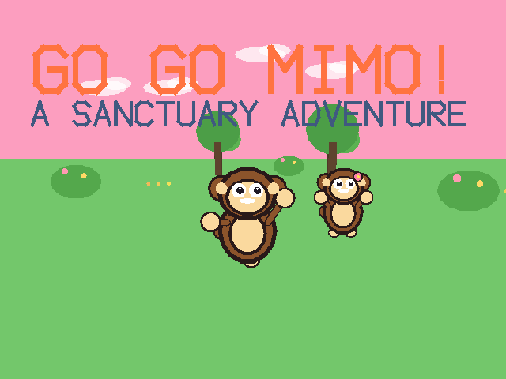
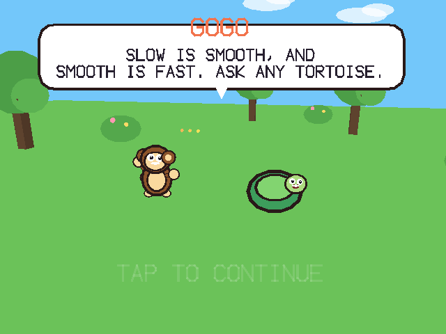

# GO GO MIMO!

GO GO MIMO! is a stereoscopic 3D run-and-explore adventure built exclusively for RayNeo X3 Pro AR glasses, controlled entirely through two fingers on a single temple pad. Playing as Mimo, a monkey whose mother has been caged by a gadget-obsessed zookeeper, the player dashes, climbs, swims, and balances across six color-drained districts, clearing falling-block puzzle challenges that recolor the world one district at a time. Progression is built around new movement abilities rather than escalating stats, with no punishing fail states, roughly two hours of content playable in short sessions, and progress saved invisibly throughout. The game is free software, released under the GPL v3.

## Screenshots

  
  

## Controls

- Swipe forward or back to dash, brake, switch lanes, or move the menu cursor
- Tap to jump (double-jump once the Spring Tail is earned), grab hoops, or choose a menu option
- Swing your arm up or down for slam-drop puzzle pieces and character interactions
- Double-tap to save and open the pause menu

## Download

[MimoRun.apk](https://github.com/tropicalstream/MimoRun/releases/latest/download/MimoRun.apk)
